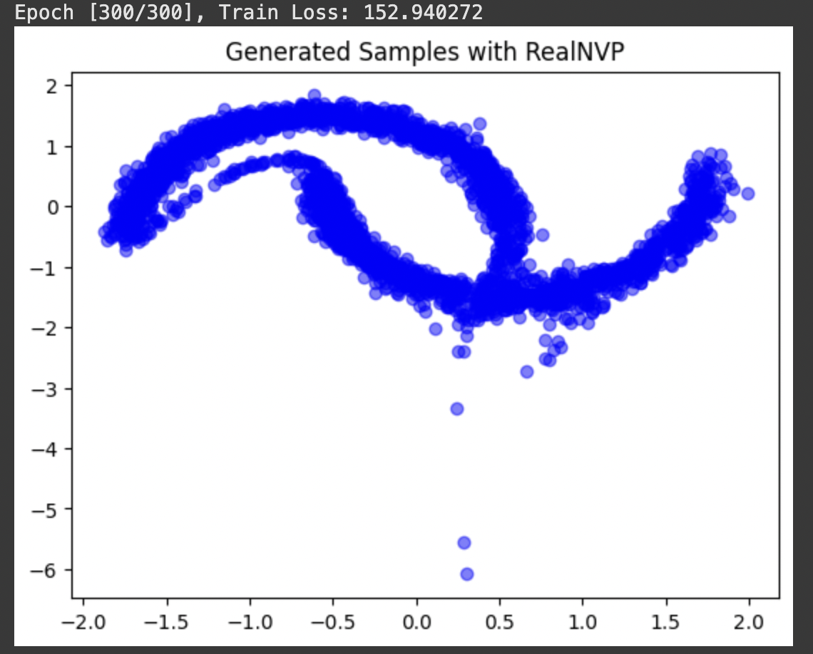

# TP4 - Flow based models

Dans ce TP, nous avons étudié les Normalizing Flows à travers le modèle RealNVP, qui est une méthode de génération de données capable de transformer une distribution simple (ex Gaussienne) en une distribution complexe.

## Dataset utilisé

Nous avons utilisé le dataset Moons, extrait de scikit-learn.  
Ce dataset contient deux groupes de points formant deux demi-cercles (en forme de lunes).  
Pour faciliter l'apprentissage, les données sont normalisées (centrées et réduites):

self.data = ((data - data.mean(0)) / data.std(0)).astype(np.float32)

---

## Méthode utilisée

**Normalizing Flows (NF)**

Un Normalizing Flow est une approche qui transforme une distribution de base simple en une distribution plus complexe en appliquant une série de transformations inversibles et différentiables.

La probabilité d'un échantillon transformé est calculée grâce à la formule de changement de variable :

\\[
p(x) = p(z) \\times \\left| \\det \\left( \\frac{\\partial z}{\\partial x} \\right) \\right|
\\]

Ici, \\( z \\) est l’échantillon dans l’espace de base, et \\( x \\) est l’échantillon transformé.

Le modèle doit être invertible pour pouvoir aller dans les deux sens : de l’espace latent aux données et inversement.

---

## RealNVP

RealNVP simplifie la structure des Normalizing Flows en utilisant des coupling layers.

Chaque couche coupe l'entrée en deux parties :

- Une partie reste inchangée,
- L'autre partie est transformée à l’aide de deux fonctions : une fonction de scale et une fonction de translation, apprises via des réseaux de neurones.

Le changement de variable est simple à calculer car le Jacobien a une structure spéciale (triangulaire), ce qui rend l’entraînement efficace.

\\[
\\left| \\det \\left( \\frac{\\partial f(\\mathbf{x})}{\\partial \\mathbf{x}} \\right) \\right| = \\exp\\left( - \\sum s(\\mathbf{x}_a) \\right)
\\]

---

## Architecture du modèle

L'architecture construite comprend :

- Plusieurs coupling layers (ici 4),
- À chaque couche, un masque est utilisé pour alterner les dimensions transformées,
- Chaque couche contient deux petits réseaux pour apprendre le scale et le translate.

**Forward pass:**
On applique chaque coupling layer les unes après les autres à x. À chaque passage dans une couche, on calcule un petit morceau du log-déterminant du Jacobien, on additionne ces petits morceaux pour obtenir un log-déterminant total.

**Inverse pass for sampling:**
On génère de nouvelles données en appliquant les coupling layers dans l’autre sens, sans recalculer les log-déterminants.

---

## Fonctionnement (Entraînement)

L'entraînement a pour objectif de maximiser la probabilité des données réelles en minimisant la Negative Log-Likelihood.

La loss utilisée est :

\\[
\\text{Loss} = -(\\log p(z) + \\log \\left| \\det \\left( \\frac{\\partial z}{\\partial x} \\right) \\right|)
\\]

- \\( z \\) est obtenu en passant \\( x \\) dans toutes les coupling layers.
- On utilise l'optimiseur Adam pour entraîner le modèle.

Le modèle apprend donc à transformer une Gaussienne pour qu’elle suive la forme du dataset "Two Moons".

---

## Échantillonnage

Pour générer de nouvelles données :

- On tire \\( z \\) depuis la distribution normale,
- On applique l'inverse des transformations (coupling layers en sens inverse),
- On obtient un nouvel échantillon \\( x \\) ressemblant aux données réelles.

## Visualisation après 300 epochs

